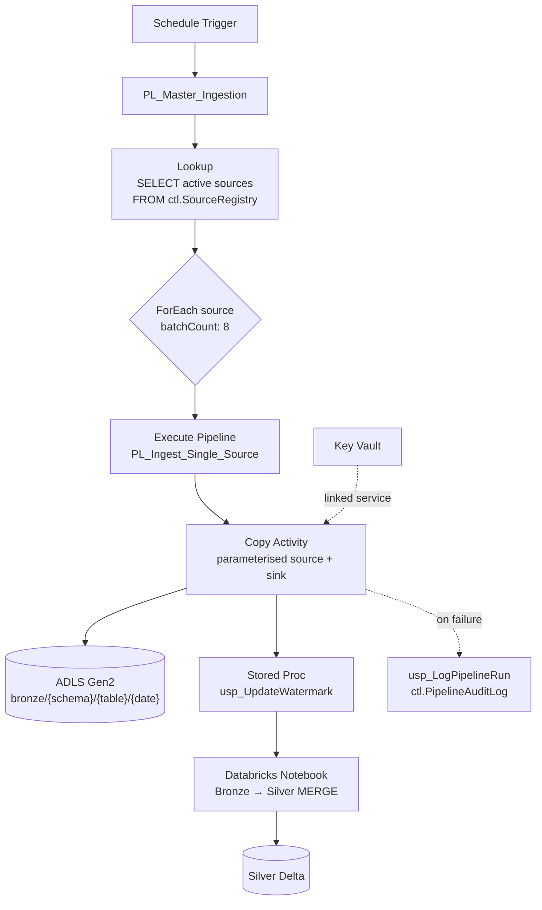

# Metadata-Driven Ingestion Framework — Azure Data Factory + Azure SQL

One pipeline that ingests **any** number of source tables. New sources are onboarded by
inserting a row into a control table — not by cloning a pipeline in the ADF designer.

The problem it solves: a team with 60 source tables ends up with 60 near-identical pipelines,
60 places to fix a bug, and a release process nobody trusts. This framework replaces all of
them with a Lookup, a ForEach and a parameterised Copy activity.

---

## Architecture



---

## The control tables

| Table | Purpose |
|---|---|
| `ctl.SourceRegistry` | One row per source object. Connection, load type, watermark column, target path, active flag. |
| `ctl.WatermarkControl` | Last successfully loaded watermark value per source. |
| `ctl.PipelineAuditLog` | Run history: rows read, rows written, duration, status, error message. |

Onboarding a new source is one `INSERT`:

```sql
INSERT INTO ctl.SourceRegistry
    (SourceSystem, SourceSchema, SourceTable, LoadType, WatermarkColumn,
     TargetContainer, TargetPath, IsActive)
VALUES
    ('SalesDB', 'dbo', 'Orders', 'Incremental', 'ModifiedDate',
     'bronze', 'salesdb/orders', 1);
```

The next scheduled run picks it up. No deployment.

---

## What this demonstrates

- **Lookup → ForEach → Execute Pipeline** control flow with `batchCount` parallelism
- Fully **parameterised datasets** — one dataset serves every SQL source, one serves every sink
- **Watermark-based incremental loading** with a stored procedure updating the high-water mark
  only after a successful copy
- **Audit logging** of every run, including row counts and failure reasons
- **Key Vault-backed linked services** — no secrets in the ARM template
- **Retry and alerting** configured at the activity level
- Delta **MERGE** in the Databricks step to apply changes to Silver

---

## Deployment

**1. Create the control database objects**

```bash
sqlcmd -S <server>.database.windows.net -d <db> -G -i sql/01_create_control_tables.sql
sqlcmd -S <server>.database.windows.net -d <db> -G -i sql/02_stored_procedures.sql
sqlcmd -S <server>.database.windows.net -d <db> -G -i sql/03_seed_registry.sql
```

**2. Import the ADF objects**

The JSON under `adf/` follows the standard ADF Git-integration layout. Point your Data Factory
at this repo (Manage → Git configuration) and the objects appear in the authoring canvas.

Update these before publishing:

- `adf/linkedService/LS_KeyVault.json` — your vault URL
- `adf/linkedService/LS_AzureSQL_Control.json` — your server and database
- `adf/linkedService/LS_ADLS_Gen2.json` — your storage account

**3. Grant access**

The Data Factory managed identity needs:

- `Get` secret permission on the Key Vault
- `Storage Blob Data Contributor` on the ADLS Gen2 account
- `db_datareader` + `EXECUTE` on the control database

---

## Repo layout

```
├── sql/
│   ├── 01_create_control_tables.sql   # SourceRegistry, WatermarkControl, PipelineAuditLog
│   ├── 02_stored_procedures.sql       # usp_GetActiveSources, usp_UpdateWatermark, usp_LogPipelineRun
│   └── 03_seed_registry.sql           # Example source entries
├── adf/
│   ├── pipeline/
│   │   ├── PL_Master_Ingestion.json
│   │   └── PL_Ingest_Single_Source.json
│   ├── dataset/
│   │   ├── DS_Generic_AzureSQL.json
│   │   └── DS_Generic_ADLS_Parquet.json
│   └── linkedService/
│       ├── LS_KeyVault.json
│       ├── LS_AzureSQL_Control.json
│       └── LS_ADLS_Gen2.json
├── notebooks/
│   └── bronze_to_silver_merge.py      # Generic MERGE driven by the same registry
└── docs/
    └── architecture.mmd
```

---

## Interview talking points

- **Why `Execute Pipeline` inside the ForEach instead of putting Copy directly in it?**
  ForEach cannot contain certain activity types, and a child pipeline gets its own run ID —
  which makes monitoring and re-running a single failed source far easier.
- **What does `batchCount` do and why 8?**
  It caps concurrent iterations. Too high and you saturate the source database; too low and a
  60-table load takes all night. 8 is a starting point you tune against source capacity.
- **Why update the watermark in a stored procedure rather than in the pipeline?**
  It runs only on Copy success, inside a transaction, and the logic lives in one place rather
  than being duplicated across pipeline JSON.
- **What happens if the copy succeeds but the notebook fails?**
  Bronze has the data, the watermark has moved, but Silver is stale. The audit log records
  the failure and the Silver MERGE is idempotent — re-running it reprocesses from Bronze
  without re-extracting from the source.
- **How would you handle deletes from the source?**
  Watermarking on a modified date cannot see hard deletes. Options: a soft-delete flag,
  change tracking / CDC on the source, or a periodic full reconciliation load.
